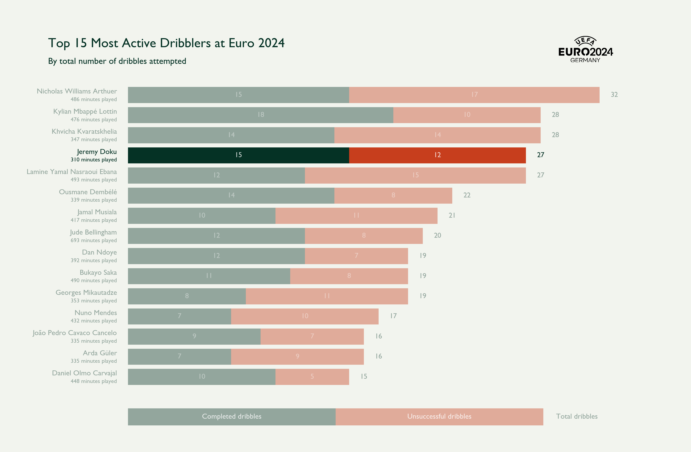
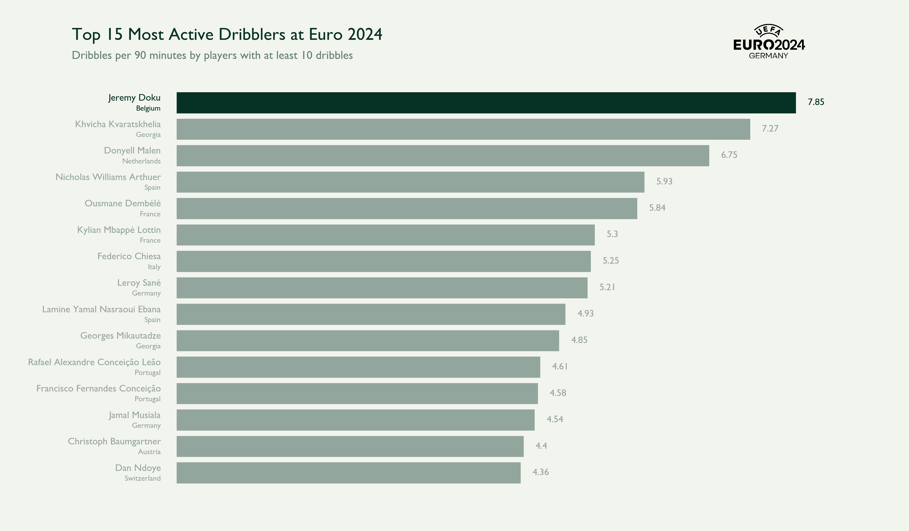
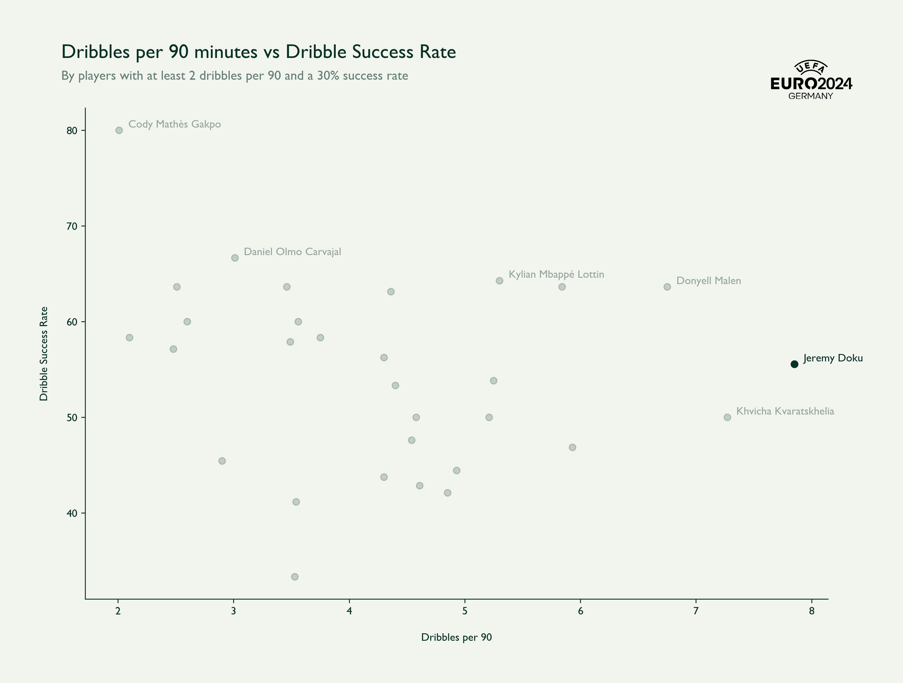
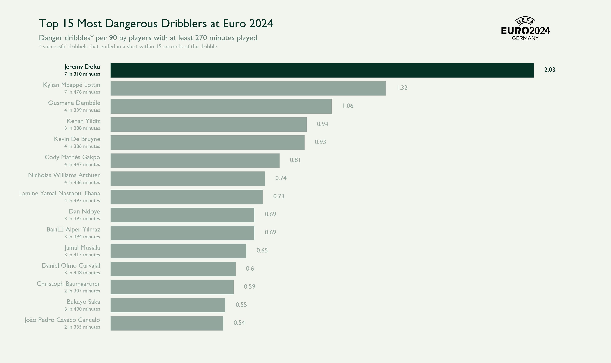
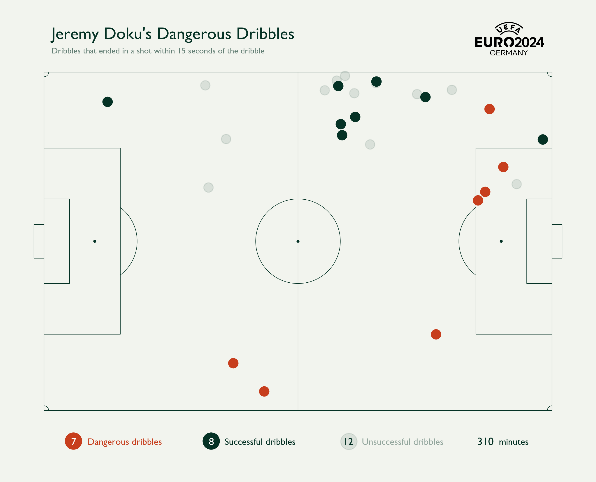

# Jeremy Doku Analysis

Since arriving on the scene at Anderlecht, Doku has always been regarded as one of Belgium's finest dribblers. With his pace and technique he can unravel a defence with ease. But doubters quickly started posing the question *"Does this actually help the team?"* 

Based on his goals and assists stats, they concluded that it wasn't. But is that true? 

We'll have a look at how he did at the Euros in 2024.

First of all, is he still a player that will look to exploit a 1v1 situation?

For sure! He ranks 4th in the whole tournament in dribbles attempted. Of course the total number of dribbles doesn't tell the whole story as Belgium were knocked out pretty early in the tournament. 

What happens when we take into account the playing time of a player? The **Dribbles per 90** stat will help us figure that out.

Based on this graph we can confidently conclude he still loves to go for a dribble and there's a strong case for calling him the most active dribbler of the tournament.

Now the next thing we should have a look at is an easy question: does he pull off all that dribbling?
What happens if we look at the **dribbles per 90 versus the succes rate of players**?

We can clearly see he's a **dangerous** player with a very high 'dribbles per 90' stat and an impressive success rate. 
He's not as clinical as Cody Gakpo, who has an amazing 80% success rate, but he attempts dribbles nearly 4 times more so it does make sense that the success rate will drop off as well.

I highlighted the word 'dangerous' there for a reason. Does a player become dangerous because he attempts a lot of dribbles and has a high success rate? Not really, it's about what happens after the dribble. And now we're getting close to the question that has lingered around Doku since the start of his career. "All those dribbles are nice but does it actually help the team?"

## Danger dribbles
What makes an action on the pitch dangerous? If it's successfull and it ends in a shot, I believe it's safe to say the action was useful and dangerous.

So I decided to have a look at all dribbles that happened in a 15 second window before a shot.

Mbappé and Doku shared the most dangerous dribbles title with 7 but if we take into account the playing time of players, the result is pretty spectacular.

## Conclusion

People might criticize his efficiency in terms of goals and assists but he clearly is an extremely dangerous player in attack that any team could use.

Now let's take a closer look at his dribbles:

It's no surprise that most of his actions are located on the left side of the pitch and that he's extremely dangerous around the box. 

But what jumps out to me is that he's also not afraid of taking on players on his own half.
It might be risky but I believe he could be a real weapon in transition as well. The fact that two of those dribbles quickly ended in a shot only confirm this thought.